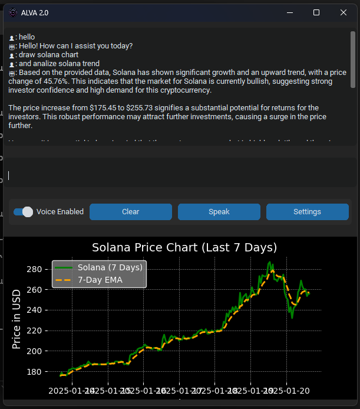

# ALVA 2.0 - Voice-Powered Cryptocurrency Assistant

ALVA 2.0 is a cryptocurrency assistant that provides market data, trends, and price charts for popular cryptocurrencies. 
It integrates voice synthesis, speech recognition, and OpenAI's GPT-4 for enhanced interaction.


## Features
- **Voice-enabled interactions**: Toggle voice synthesis for listening to responses.
- **Cryptocurrency data**: Get market trends and visual charts for supported cryptocurrencies.
- **Speech recognition**: Speak directly to the assistant for queries and commands.
- **OpenAI integration**: Use GPT-4 for general questions and crypto analysis.

---

## Installation

1. **Install Python**:  
   Download and install Python (version 3.8 or later) from the [official website](https://www.python.org/downloads/).  
   During installation, ensure you check the option **"Add Python to PATH"**.  

   Alternatively, you can use the following commands to install Python on macOS or Linux:

   - macOS:
     ```bash
     brew install python
     ```

   - Ubuntu/Debian-based Linux:
     ```bash
     sudo apt update && sudo apt install python3 python3-pip
     ```

2. **Install Dependencies**:  
   Run the following command to install all necessary Python libraries:
   ```bash
   pip install customtkinter pyttsx3 matplotlib requests SpeechRecognition openai rapidfuzz Pillow numpy

3. **Set Up API Key**:
Replace "API-OpenAI" in the code with your OpenAI API key or input it via the app's settings window.

4. **Run the Application**:
Execute the Python file in your terminal:
   ```bash
   python ALVA v2.0.py

